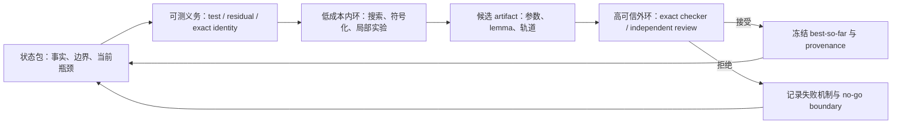

# Slack-variable 三块 ADMM：AI 辅助科研过程审计与长程工作分析

日期：2026-07-19
统计截止：本报告审计任务启动前
证据口径：仓库 artifact、Codex session event、本地 pytest collection、proof-review 包、arXiv 2607.05155

## 执行摘要

这个项目在约 18 个自然日内，把一个最初的开放问题

> identity / slack 第三块是否足以保证原始 direct three-block ADMM 收敛？

推进为一个否定性、可机器复验的结论：即使
\(A=B=I_2\)、\(\beta=1\)，且前两块目标都是纯强凸二次函数，原始 direct slack ADMM
仍可出现严格的、有界的、非 KKT 最小 66 周期。这里证明的是 bounded periodic
nonconvergence，不是无界发散，也不是对所有 ADMM 变体的否定。

过程审计的核心数字如下。

| 指标 | 审计结果 | 正确解释 |
| --- | ---: | --- |
| 日历跨度 | 17 天 13 小时 10 分，覆盖 18 个自然日 | 从首个项目 Codex session 到报告前最后一个项目 session |
| 有 artifact 修改的日期 | 16 天 | 7 月 1 日、7 月 4–18 日 |
| 完成态非重叠活跃墙钟时间 | 71.85 小时 | 合并并行重叠后的 `task_complete` 区间；不是人工工时 |
| 完成态累计 agent-hours | 97.50 小时 | 735 个 completed turns；主 agent 79.13 + subagent 18.37 小时 |
| 含中止尝试的总投入 | 105.62 agent-hours / 74.50 wall-hours | 再纳入 45 个 aborted-only turns；root 84.66 + subagent 20.97 agent-hours |
| 主任务 session | 14 个 | 本报告启动前、cwd 精确匹配本项目的 user sessions |
| 建立的 subagent session | **251 个** | 实际 `thread_source=subagent` 的 session；不是 reviewer 名称数 |
| 唯一 agent turn | 790 个 | 735 completed + 45 aborted-only + 10 个未见终态 |
| 顶层数学场景 | **9 类** | 按研究问题和证据作用归类，不按文件数拼凑 |
| canonical pytest checks | **261 个** | `tests/` 中可单独收集的测试项 |
| 投稿包 pytest checks | 另有 6 个 | 与 `tests/` 中同名模块冲突，当前不能声称 267 项根级一次全绿 |
| 机器可读 certificate JSON | **68 个** | 只统计 basename 含 `certificate` 的 JSON；含局部/子盒证书 |
| proof-review 包 | **65 个** | 包含通过、条件通过和 incomplete，不等于 65 个定理 |
| `final_verification.json` | **28 个，均为正面 verdict** | 复核记录数，不等于最终反例数 |
| 决定性最终反例 | **1 个逻辑证书** | period-66；另有 raw-state 第二实现和 precision audit 支持 |

最重要的管理结论是：**251 个 subagent 是投入量，不是科研质量。** 本项目真正形成价值的
部分，是把大量失败筛查逐步压缩为状态文件、精确义务、可运行 checker、机器证书和独立
review gate，最终留下一个能够被两条不共享实现的 exact 路径复验的核心反例。

## 1. 研究结论与证据边界

### 1.1 已解决的主问题

当前 source of truth 是投稿实例 `identity_slack_p66_short_v1`。它给出：

- 二维模型，\(A=B=I_2\)，\(\beta=1\)；
- \(Q_1,Q_2\succ0\)，目标无一次项；
- 唯一 KKT 点；
- mask word 为 \((00)^2(01)^{64}\)；
- 66 步精确闭合，前 65 步不提前返回；
- 132 个投影符号不等式全部 strict，统一余量大于 \(10^{-3}\)；
- 轨道有界且非 KKT，因此原始 direct slack three-block ADMM 不收敛。

主张边界必须同时保留：

- 这是 identity-slack 子类中的严格有界周期反例；
- 不是无界发散；
- 不是对 proximal、relaxed、prediction-correction 或 ADM-G 等修正算法的反例；
- 两套 exact checker 是仓库内 implementation-independent cross-check，不是外部独立同行评审；
- “首个此类反例”的 novelty 表述仍需使用 `to the best of our knowledge`。

### 1.2 反例没有抹掉的正向结果

反例否定的是“无附加条件的全局收敛”。项目中仍保留多类有界范围内的正向定理或充分条件：

- scalar / coordinatewise、fixed-mask 和若干短周期排除；
- phase-dependent Lyapunov、small-gain 和 optimized scaling；
- Selector-IQC 的对角无损条件与非正规鲁棒邻域；
- fixed-QP / affine-family signed-PWA contraction；
- corrected VI/PPC、ADM-G 与 image-regular modified algorithm 分支；
- 对同一个反例 QP 的 multiplier relaxation 局部稳定与有限前缀捕获。

这些结果不能被合并成原始 general direct ADMM 的收敛证明。

## 2. 时间：到底“用了多久”

### 2.1 三种不能混用的时间

本报告同时给出三种时间，因为任何一个单独数字都会误导。

1. **日历跨度**：2026-07-01 00:26:06 至 2026-07-18 13:36:11（Asia/Shanghai），
   共 421.17 小时，即 17 天 13 小时 10 分。
2. **完成态非重叠活跃墙钟时间**：把所有有完成记录的 turn 区间合并后为 71.85 小时。
   并行运行只计一次，较接近“系统实际处于工作状态多久”。
3. **完成态累计 agent-hours**：735 个 completed turns 的 `duration_ms` 求和为
   97.50 小时，其中主 agent 79.13 小时、subagent 18.37 小时。并行 subagent
   会重复计时，较接近已完成 AI 执行投入。
4. **含失败尝试的总投入**：日志还有 45 个只有 `turn_aborted` 的唯一 turn。
   纳入它们后为 105.62 agent-hours（root 84.66、subagent 20.97），非重叠墙钟
   74.50 小时。另有 10 个 started turns 未见 completion 或 abort 终态，不作时长估计。

上述数字排除了本报告自身创建的 1 个主 session 和 3 个审计 subagent。它们也不包含
用户离线阅读、讨论、等待外部人员、人工排版等时间，不能换算成人类全职工作日或 GPU-hours。
`duration_ms` 还包含工具等待，因此也不等于纯推理、CPU 或 GPU 计算时间。

仓库文件时间给出一个独立交叉检查：artifact 修改窗口为 2026-07-01 00:32:30 至
2026-07-18 13:21:48，覆盖 16 个活跃日期。Git 只有少量提交且 worktree 很脏，因此不能用
commit 数或 commit 时间估算科研工期。

### 2.2 阶段时间线

| 阶段 | 关键变化 | 长程作用 |
| --- | --- | --- |
| 7 月 1 日 | 建立问题形式、符号约定、随机 QP / spectral-radius 工作台 | 先把问题变成可运行任务 |
| 7 月 4–11 日 | fixed-mask、length-2/3、source-target transfer、exact admissibility | 把普通搜索压缩为结构化 proof obligations |
| 7 月 12 日 | phase metric、small gain、Selector-IQC、signed-PWA 等充分条件 | 建立正向边界，而不是只找失败 |
| 7 月 13 日 | nested three-cycle 与 `E00` endpoint exact closure | 关闭短周期假反例路线，推动更长 itinerary |
| 7 月 14 日 | Stage 43 局部扩张障碍，随后发现并有理化 period-66 | 主命题由“未证”变为“严格为假” |
| 7 月 14–16 日 | raw 6D 第二实现、precision audit、multiplier relaxation | 降低 common-mode 风险并研究修复条件 |
| 7 月 17–18 日 | MATLAB 交叉复算、论文与 Overleaf 交付 | 从仓库内结论转为可外部复现的研究包 |

## 3. 测试了多少场景

### 3.1 推荐的单一回答

如果“场景”指数学问题类型，本项目覆盖 **9 类顶层场景**。如果“场景”指当前 canonical
自动回归，则是 **261 个 pytest checks**，投稿包另有 6 个。两种数字回答的是不同问题，
不能相加。

### 3.2 九类顶层数学场景

| # | 场景 | 代表性覆盖 |
| ---: | --- | --- |
| 1 | 随机 QP 与谱半径 baseline | 固定 seed 的 5-trial smoke、局部 active-set radius |
| 2 | fixed-mask 局部递推 | full/effective/reduced map、stay-in-region、invariant expansion 排除 |
| 3 | length-2 switching | 12 个 ordered pairs 压缩为 4 个 canonical representatives |
| 4 | length-3 switching | 60 个非恒定 words 压为 11 类；coordinatewise、projector、scaled-rank-one、full-rank；55/55 margins closed |
| 5 | length-4 与有限 closed words | Hamiltonian 24 words 压为 3 类；exact short-word admissibility |
| 6 | nested mask 与 arbitrary switching | two/three/four-cycle、source-target transfer、cone/path-complete gates |
| 7 | 正向充分条件 | phase metric、small gain、Selector-IQC、signed-PWA、鲁棒邻域 |
| 8 | proof-grade counterexample | 66 phases、132 strict inequalities、两条 exact 实现路径 |
| 9 | 修复算法与参数 | multiplier relaxation、VI/PPA/PPC、ADM-G、image-regular corrected route |

有用但不可相加的微观枚举量包括：

- Stage 2 对 length 2–8 共筛过 87,348 个二维非恒定 mask itineraries；
- periodic-margin 层对 length 2–5 共处理 157 个 canonical words；
- 固定有理 QP 的 length 1–4 exact admissibility 覆盖 340 个 tagged closed words；
- 最终周期覆盖 66 个 phase 和 132 个严格投影符号义务。

这些集合互相嵌套或使用不同 QP/等价关系，把它们求和会制造一个没有数学意义的“总场景数”。

### 3.3 自动化回归状态

- `tests/` 有 55 个 `test_*.py` 文件和 261 个可收集测试项；
- `report/latex/arxiv/` 的独立投稿包测试另有 6 项；
- 从仓库根目录直接运行 pytest 时，两个同名的
  `test_relaxed_multiplier_interval_theory.py` 会产生 import-file-mismatch；
- 因此当前可说“定义了 267 个 checks，canonical `tests/` 作用域有 261 个”，不能说
  “267 项在一个命令中全绿”。

本轮实际验证为：

- `pytest -q tests` 连续运行 15 分 29 秒后由审计主动中止；中止前 `83 passed`、没有测试失败，
  但这不是全量通过结论；
- period-66 主证书、raw 6D 独立复算、precision、fixed-decimal 和 teacher package 的定向回归
  为 `6 passed in 2.12s`；
- 投稿实例 pair verifier 使用临时输出重建 raw/signed 两套证书，结果为
  `status=passed`、`valid=true` 且所有 comparison flags 为 true。

历史状态中的 `209 passed, 2 SIGKILL` 只代表当时快照；两个资源型失败虽然后来隔离通过，也
不能替代当前 261 项全量回归。

## 4. 留下了多少证书

“证书”至少有四种口径。本项目不应只报一个未经说明的文件数。

| 层级 | 数量 | 含义 |
| --- | ---: | --- |
| basename 含 `certificate` 的 output files | 115 | 含 Markdown/JSON 镜像、局部盒、scaffold 等 |
| 其中机器可读 JSON | **68** | 最适合作为“机器证书 artifact”库存数 |
| 任一路径组件含 `certificate` 的 files / JSON | 125 / 73 | 会额外把名为 certificate 的 stage 目录内普通文件计入 |
| proof-review packages | **65** | 研究结论的 review 容器，不保证 verdict 为正 |
| 标准 review records | 67 | 58 clean positive、5 incomplete、4 conditional，分布于 62 个包 |
| `final_verification.json` | **28** | 当前 28 条均为 accept/correct/ship 类 verdict |
| 逻辑上的最终 counterexample | **1** | period-66 bounded non-KKT orbit |

最终反例的支持结构应理解为“一项主张、两条实现、两层审计”：

1. Stage 44：signed 4D recurrence 的 exact rational certificate；
2. Stage 45：不导入 Stage 44 checker 的 raw 6D original-ADMM replay；
3. Stage 46：decimal precision / frozen parameter audit；
4. 投稿包：`certificate_signed.json` 与 `certificate_raw.json` 共享 hashes 并通过 pair verifier。

这四项不是四个反例。它们共同降低同一个 period-66 结论的实现风险。当前仍缺真正的外部独立
review 或 proof-assistant formalization。

## 5. 建立了多少 subagent

### 5.1 审计结果

本报告启动前，session metadata 中共有 **251 个实际 subagent sessions**，均满足：

- `cwd` 精确等于本项目目录；
- `thread_source` 等于 `subagent`；
- 每个 session id 只计一次。

其中 246 个 subagent sessions 留下至少一个 completion 或 abort 终态，5 个未见终态。
它们产生 279 个 completed subagent turns，说明少数 subagent 被 follow-up 复用。
此外有 94 个不同 nickname 标签，但 nickname 会复用，也不代表 94 个独立模型或人格，不能用作
subagent 数。reviewer 名称、proof-review 目录和 subagent session 也不是一一对应关系。

### 5.2 为什么这个数字不足以衡量科研效率

当前仓库没有稳定的 `subagent_id -> hypothesis -> artifact -> verdict` 映射，所以不能严谨计算：

- 每个 subagent 产生了几个可接受 lemma；
- 多少 subagent 只做了重复搜索；
- 哪个证书由哪些 agent 共同完成；
- 从候选到 accepted review 的真实转化率。

下一轮最值得新增的不是更多 subagent，而是一个轻量 provenance ledger：至少记录
`agent/session id`、`work order`、`input state hash`、`claim`、`artifact paths`、`review verdict`、
`superseded_by`。这会把“251 个投入”转化为可比较的有效增益率。

## 6. 结合 EdgeBench 分析长程科研关键环节

[EdgeBench](https://arxiv.org/abs/2607.05155) 研究的是 agent 在真实可执行环境中如何随交互时间
持续改进。论文覆盖 134 个任务、约 38,000 agent-hours，每题至少支持 12 小时；其聚合
best-so-far 曲线服从高精度 log-sigmoid，134-task 主实验的平均拟合约为 \(R^2=0.998\)。
论文还报告：连续保留 workspace、artifact 和反馈历史的 12 小时运行，相比 6 次互相清空状态的
2 小时重启，在 17-task 对照中达到 43.0 对 36.1，提升 6.9 分。需要注意，这些是多任务聚合
和 benchmark 实验结论，不能直接外推为本 ADMM 单项目的 scaling law。

### 6.1 最关键：先把研究变成可测量环境

EdgeBench 的重力波案例先建立可评分 pipeline，再分解误差、锁定瓶颈、保留稳定核心。该项目中
对应的决定性动作是：

- 固定 multiplier sign convention 和 projection identity；
- 把 active set 写成 exact affine/reduced maps；
- 把“看起来不稳定”转成 stay-in-region、period closure、KKT 与 strict-sign obligations；
- 把候选参数有理化并交给独立 checker。

没有这些 evaluator，长时间运行只会增加文字和浮点候选；有了 evaluator，失败也能变成 exact
no-go gate。

### 6.2 内外双环必须分离

EdgeBench 使用快速本地内环和隔离权威 judge 外环。本项目的对应关系是：

| EdgeBench | 本项目 |
| --- | --- |
| local tests / simulators | random screen、symbolic identities、pytest、Bernstein/Sturm scripts |
| hidden or authoritative judge | exact rational certificate、独立 raw replay、proof-review gate |
| evaluator-only trajectory | `research_state.md`、review manifest、certificate hashes |
| work/judge isolation | 候选生成器与 verifier 不共享实现；screen 不得升级为 theorem |

本项目目前最明显的外环缺口是：已经有内部双实现与 adversarial audit，但尚无外部独立 reviewer。

### 6.3 状态积累比重复重启重要

项目能从 fixed-mask、短周期一路推进到 period-66，依赖的不是某个超长对话，而是外部状态：

- `research_state.md` 保留当前事实和 claim boundary；
- `work_orders.md` 规定下一 proof gate；
- `notes/` 保存失败路线及其 supersession；
- `outputs/` 保存可重跑证据；
- `proof_reviews/` 保存独立 verdict；
- manifest/hash 把投稿实例冻结。

这与 EdgeBench 的“连续经验优于独立重启”一致。长 context 有帮助，但真正跨 compaction、跨 agent、
跨天生效的是简短、可装载、可审计的文件状态。

### 6.4 优化有效增益率，而不是提交次数

EdgeBench 发现更强 agent 的优势不是单纯提交更多，而是更常把反馈转成可保留的 best-so-far
改进。本项目也应把 KPI 从“启动了 251 个 subagent”改成：

- accepted claim / completed proof obligation；
- 被 exact gate 排除的错误分支；
- 有独立 checker 的证书；
- 能使 `research_state.md` 前沿真正移动的更新；
- 被后续 artifact 复用的 lemma 或代码。

尤其不能用 `68 certificates / 251 subagents` 计算简单转化率，因为证书与 agent 是多对多关系，
当前 provenance 不支持这种归因。

### 6.5 保留 best-so-far，并把失败结构化

本项目最成功的长程模式不是持续扩大搜索，而是：

1. ordinary random scan 只作 baseline；
2. fixed-mask 候选失败后，提炼为 positive expansion impossible；
3. length-2/3/4 失败后，留下 canonical class 与 exact no-go certificates；
4. common/static Lyapunov 被局部扩张击穿后，切换到真实 itinerary；
5. 找到 66 周期后冻结短参数实例，并用第二实现回放；
6. 主命题解决后，转向 multiplier relaxation 和 corrected algorithms。

失败没有被删除，而是变成“后续不得重复”的路线边界。这正是长程科研中的可复用经验。

### 6.6 续跑、故障恢复与评测安全属于科研方法

EdgeBench 把 auto-resume、定时快照、服务稳定性和 evaluator hacking 都视作长期评测的一部分。
本项目相应需要：

- root pytest collection、资源峰值和 duplicate-module 问题都写入证据账本；
- 长脚本保存中间证书和 deterministic input，而不是只留终端输出；
- candidate generator、checker 和 reviewer 尽量减少共享代码；
- 不向生成 agent 泄露 evaluator-only final conditions；
- 对随机 seed、best-of-N 与可见 proxy 保持过拟合警惕。

EdgeBench 并没有研究并行 multi-agent 编排；其 Ralph loop 是同一 workspace 上的顺序 fresh-context
invocation。因此论文支持“状态延续、反馈与独立评测很重要”，不支持“subagent 越多越好”。

## 7. 建议的长程 AI 科研闭环

对本项目，下一阶段优先级应是：

1. 为 251 个历史 subagent 建立最小 provenance 映射，而不是继续增加数量；
2. 修正根级 pytest duplicate-module collection，使 267 个 checks 能在明确命令下统一审计；
3. 为 period-66 投稿实例争取真正的外部独立复核；
4. 保持“一个逻辑反例、两条内部实现”的清晰计数；
5. 把正向研究集中在排除 66-cycle 机制的最小附加条件和 corrected algorithms。

## 8. 可复核入口

- 研究状态：`research_state.md`
- 工作单：`work_orders.md`
- 符号约定：`notes/z_projection_identity.md`
- 核心反例说明：`notes/strict_rational_66_cycle_counterexample.md`
- Stage 44：`outputs/breakthrough_attempts/stage44_strict_rational_66_cycle/certificate.json`
- Stage 45：`outputs/breakthrough_attempts/stage45_independent_raw_admm_audit/certificate.json`
- 投稿实例 manifest：`report/latex/arxiv/instance_manifest.json`
- 投稿 pair verifier：`report/latex/arxiv/verify_certificate_pair.py`
- 最终 legacy 审计：`report/final_resolution_2026-07-14.md`
- EdgeBench：[arXiv abstract](https://arxiv.org/abs/2607.05155)、[PDF](https://arxiv.org/pdf/2607.05155)

## 9. 统计口径说明

- session 统计只纳入 `cwd` 精确匹配本项目的 Codex records；
- 本报告自身的 1 个主 session 和 3 个审计 subagent 不纳入 251；
- turn 按全局 `turn_id` 去重，避免 fork session 重放父事件造成多算；
- 完成态时间来自 `task_complete.duration_ms`；总投入再纳入无 completion 的 `turn_aborted.duration_ms`；
- “场景”优先按数学义务分类，pytest 和 enumeration 作为独立覆盖指标；
- “certificate JSON=68”采用 basename 口径，避免把 certificate-named directory 内的普通文件误计；
- review verdict 是 artifact 的内部审查状态，不等于外部同行评审。
