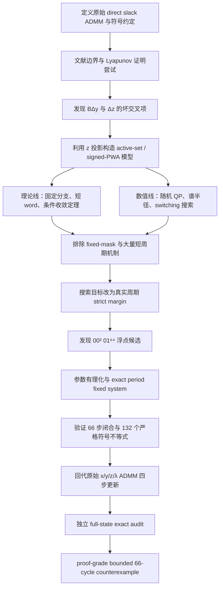

# Slack-variable 三块 ADMM：从收敛性证明到严格反例的搜索流程

日期：2026-07-14
状态：`workflow_summary_after_core_resolution`
最终证据等级：`proof_grade_in_repository_with_two_exact_implementations`
外部独立复核：`not_yet_externally_reviewed`

## 1. 一页结论

本项目研究的问题是：把不等式约束写成带 identity slack block 的三块等式约束后，原始 direct three-block ADMM 是否会自动获得全局收敛性。

研究没有停留在“证明没有做出来”，而是沿理论和数值两条路线逐步缩小范围：

1. 理论推导定位 projection-only Lyapunov 证明中的坏交叉项；
2. 将 slack 投影改写为有限个 active-set 仿射分支；
3. 数值搜索局部谱扩张，理论检查这些扩张是否能留在真实 active region；
4. fixed-mask 机制失败后，转向 active-set switching；
5. 对短 switching words 做对称约化、Schur/Jury 分析和 exact 非负证书；
6. 短周期不断被排除后，数值目标从“最大化谱半径”改成“最大化真实周期的严格投影余量”；
7. 最终找到并有理化一个 mask word 为 `00, 00, 01 × 64` 的严格 66 周期；
8. 用两套相互解耦的 exact 实现验证周期闭合、原始 ADMM 更新和投影可达性。

最终结论是：即使 (A=B=I_2)、\(\beta=1\)，且两个目标都是纯强凸二次函数，原始 direct slack-variable three-block ADMM 仍可能沿一个有界、非 KKT、最小周期为 66 的轨道运行。因此，该模型类的无条件全局收敛命题为假。

这不是无界发散反例，而是 **bounded periodic nonconvergence counterexample**。

## 2. 整体流程图



## 3. 第零步：把问题、算法和符号固定下来

原始不等式约束问题为

\[
\min\{\theta_1(x)+\theta_2(y)\mid Ax+By\le b\}.
\]

引入 slack variable 后得到

\[
\min\{\theta_1(x)+\theta_2(y)\mid Ax+By+z=b,\ z\ge0\}.
\]

仓库使用的增广拉格朗日函数符号是

\[
\mathcal L_\beta
=\theta_1(x)+\theta_2(y)
-\lambda^T(Ax+By+z-b)
+\frac\beta2\|Ax+By+z-b\|^2,
\]

因此 multiplier update 为

\[
\lambda^{k+1}
=\lambda^k-\beta(Ax^{k+1}+By^{k+1}+z^{k+1}-b).
\]

在这个符号约定下，active inequality 对应的 multiplier 满足 \(\lambda_i\le0\)。如果改用通常的非负乘子，则应令 \(\mu=-\lambda\)。

固定符号的目的不是形式整齐，而是防止后续在 normal cone、complementarity、active mask 和原始 ADMM 回代时发生整体符号翻转。

## 4. 第一阶段：理论证明先暴露真正的障碍

正向路线首先尝试利用 slack block 的投影结构证明下降。投影公式是

\[
q^{k+1}
=b-Ax^{k+1}-By^{k+1}+\lambda^k/\beta,
\qquad
z^{k+1}=\Pi_{\mathbb R_+^m}(q^{k+1}).
\]

投影的 firm nonexpansiveness 确实提供了单调性控制，但候选能量中仍出现

\[
\left\langle
B(y^{k+1}-y^k),\ z^{k+1}-z^k
\right\rangle.
\]

仅靠投影结构无法统一吸收这个交叉项。标准 VI/PPA 条件在原始 direct slack ADMM 上也出现相同性质的负方向。

这个结论的证据标签是：

- `proof attempt / obstruction diagnostic`；
- 不是收敛定理；
- 也不是发散反例。

它的作用是把研究分成两条清晰路线：

- 给附加假设或修正算法建立条件收敛定理；
- 对原始 direct 算法寻找真实 active-set 反例。

## 5. 第二阶段：把 ADMM 化成有限分支动力系统

在第一次 projection/multiplier update 后，令

\[
q=z+\lambda
\]

（最终反例取 \(\beta=1\)）。由 projection identity 得到

\[
z=q_+,
\qquad
\lambda=q_-.
\]

对二次目标和 (A=B=I\)，定义

\[
M=(Q_1+I)^{-1},
\qquad
N=(Q_2+I)^{-1}.
\]

原始 ADMM 可以在 signed state \(s=(y,q)\) 上精确写成

\[
\begin{aligned}
r&=(I-M)b+Mc_1-c_2,\\
p&=My-(I-M)|q|+r,\\
y^+&=Np,\\
q^+&=(I-N)p+q_++c_2.
\end{aligned}
\]

一旦固定 \(q\) 的符号模式，\(|q|\) 和 \(q_+\) 就都是线性的，因此每个 active mask 对应一个仿射映射

\[
s^+=T_Ds+c_D.
\]

原优化算法由此变成一个 finite switched affine / signed-PWA system。后面的搜索可以明确区分三个层次：

1. 单个分支矩阵是否扩张；
2. 多个分支的 product 是否扩张或产生周期；
3. 假设的 mask word 是否由真实投影轨道严格实现。

## 6. 第三阶段：局部谱半径搜索，以及第一个重要失败

早期数值路线依次执行：

- 带固定 seed 的随机凸 QP 筛查；
- fixed-active-set 线性/仿射矩阵构造；
- all-mask 谱半径扫描；
- active-region stay-in-region 检查；
- 对近单位模态和扩张模态做定向优化。

搜索曾得到局部谱半径约为

\[
1.00226
\quad\text{和}\quad
1.00793
\]

的 pressure candidates。但对应的扩张方向会旋转或越过投影边界，轨道不能永久停留在被假设的 fixed mask 内。

因此项目确立了第一条反例门槛：

\[
\rho(T_D)>1
\quad\not\Rightarrow\quad
\text{原始 ADMM 不收敛}.
\]

理论线随后对 fixed-mask 机制做进一步分析，排除了 cone-compatible 的正实向外扩张射线。这个结果迫使反例搜索从

> 同一个 active region 内持续扩张

转向

> 多个 active regions 之间 switching 导致不收敛。

## 7. 第四阶段：理论与数值共同压缩 switching 搜索空间

对一个 mask word

\[
\mathcal W=(D_0,D_1,\ldots,D_{L-1}),
\]

可以研究 product map

\[
T_{\mathcal W}=T_{D_{L-1}}\cdots T_{D_0}.
\]

这时理论与数值形成反复循环：

1. 数值找最危险的 mask pairs 或 words；
2. 利用 cyclic shift、坐标交换等对称性压缩 canonical classes；
3. exact symbolic computation 提取 characteristic polynomial；
4. 用 Schur/Jury margins 表达单位圆稳定性；
5. 数值定位最小 margin、坏盒、边界面或退化子族；
6. 用 Bernstein、Sturm、平方分解、PSD、Cayley 或 AM-GM 等方法闭合 exact 非负性；
7. 通过 proof review 后，才把局部结论升级为 theorem。

这一阶段的主要缩域结果包括：

- 二维非恒定 length-2 ordered pairs 的局部 nonexpansion theorem；
- length-3 words 从 60 个压缩为 11 个 canonical classes；
- 对相应 length-3 reduced products 闭合 55 个 Schur/Jury margins；
- commuting、rank-one、scaled rank-one 和 full-rank interior 子问题逐层闭合；
- 在相应 nested-mask 子模型中排除若干二周期、三周期和四周期机制；
- 建立 small-gain、phase-dependent metric、common metric 和 Selector-IQC 等条件收敛区域。

必须注意：这些结论只在各自明确的参数域、维数和模型约化下成立。它们不能拼接成一般全局收敛定理。

但它们给反例搜索提供了非常强的结构信息：简单 fixed-mask、许多短 switching words 和大量低维边界机制都不是反例来源。

## 8. 第五阶段：从“搜谱半径”改成“搜严格可达周期”

这是搜索方法的关键转折。

对固定 word \(\mathcal W\)，其 period map 写成

\[
s^L=P_{\mathcal W}s^0+a_{\mathcal W}.
\]

若 \(I-P_{\mathcal W}\) 可逆，则该 word 唯一可能的周期点是

\[
s^0=(I-P_{\mathcal W})^{-1}a_{\mathcal W}.
\]

接下来不再只优化 \(\rho(P_{\mathcal W})\)，而是检查这个周期点在所有 phase 上是否严格满足预定符号条件。定义

\[
m(\mathcal W)
=\min_{0\le k<L}\min_i
\{\text{phase }k\text{、coordinate }i\text{ 的 signed projection margin}\}.
\]

判定含义是：

| margin | 含义 | 证据状态 |
| --- | --- | --- |
| \(m>0\) | 周期严格位于所有预定 active cells 内 | 可进入 exact certification |
| \(m=0\) | 轨道碰到投影边界或 tie | 需要单独处理，不能直接称为严格周期 |
| \(m<0\) | 预设 word 与真实投影不一致 | 排除该 candidate |

因此数值优化目标改成

\[
\max_{\text{QP parameters}}m(\mathcal W).
\]

早期对 length 2--5 的 157 个 canonical 非恒定 words 没有找到正 margin candidate。这只是 `numerical_periodic_margin_optimization` failure map，不证明这些长度不存在周期。

在后续 exact local-expansion obstruction 和真实 ReLU itinerary 搜索的共同引导下，搜索最终找到

\[
\mathcal W
=(00,00,\underbrace{01,\ldots,01}_{64\text{ 次}}).
\]

这个形态揭示了反例为什么难找：它不是频繁切换的短周期，而是在一个近临界分支停留 64 步，只用两步 `00` 完成闭环。

## 9. 第六阶段：浮点候选如何晋升为 proof-grade 反例

浮点搜索只负责发现候选。最终反例通过了如下晋升门。

### 9.1 模型合法性

- 将搜索得到的参数有理化；
- 精确证明 \(Q_1,Q_2\succ0\)；
- 证明两个 ADMM 子问题唯一可解；
- 精确求出原 QP 的唯一 KKT 点。

### 9.2 周期闭合

- 在有理数域构造 66 步 affine period map；
- 精确解 period fixed system；
- 验证
  \[
  s^{66}=s^0.
  \]

### 9.3 真实投影可达性

全部 66 phases、两个投影坐标的 132 个符号不等式都严格成立，并且

\[
\min_{k,i}\operatorname{margin}_{k,i}>\frac{1}{1000}.
\]

实际最小值约为

\[
0.004341079684406849.
\]

因此不存在浮点 tie、facet ambiguity 或预设错误 branch。

### 9.4 回到原始 ADMM

第一套 checker 从四维 signed state 构造周期，然后逐 phase 重算：

- \(x\)-subproblem；
- \(y\)-subproblem；
- \(z=(q)_+\) 投影；
- multiplier update。

所有等式都在 exact rational arithmetic 中成立。

### 9.5 第二套实现交叉验证

第二套 checker 不导入第一套 certifier，也不使用 signed-state recurrence。它直接在六维 full state

\[
u=(y,z,\lambda)
\]

上从原始 ADMM 子问题重建仿射映射，再独立验证：

- source/target mask 索引；
- 两个子问题的一阶最优性；
- 投影和互补性；
- multiplier update；
- 66 步闭合；
- phase 1--65 没有提前返回；
- 有线性项版本与纯二次版本之间的平移共轭。

这降低了两个证书共享同一 reduced recurrence 实现错误的风险，但仍不等同于外部独立审稿。

## 10. 最终反例解决了什么

最终模型可以写成

\[
\min_{x,y,z}
\frac12x^TQ_1x+\frac12y^TQ_2y,
\qquad
x+y+z=\bar b,
\qquad
z\ge0,
\]

其中 \(Q_1,Q_2\succ0\)，且取 \(A=B=I_2\)、\(\beta=1\)。

| 问题 | 结论 | 证据等级 |
| --- | --- | --- |
| identity slack block 是否自动保证 direct 三块 ADMM 收敛？ | 否 | proof-grade in repository |
| 反例是否依赖非凸性？ | 否，两个目标均强凸二次 | exact |
| 反例是否依赖奇异或多值子问题？ | 否，子问题唯一 | exact |
| 周期是否只是浮点近似返回？ | 否，66 步有理精确闭合 | exact |
| 投影 itinerary 是否真实可达？ | 是，132 个严格不等式 | exact |
| 轨道是否无界？ | 否，轨道有界且周期 | exact |
| 轨道是否收敛到 KKT 点？ | 否，周期点不是唯一 KKT 点 | exact |

因此，一个有限初值产生的非 KKT 周期轨道已经足以否定“所有有限初值都全局收敛”的命题。

## 11. 不能越界声明的内容

当前结果不能被改写成以下更强结论：

1. 没有证明 iterates 无界；
2. 没有证明 66 是所有可能反例中的最短周期；
3. 没有给出全部参数的收敛/不收敛分类；
4. 没有否定 small-gain、common metric、Selector-IQC、标量、对角、特定参数盒或 corrected algorithms 的条件收敛定理；
5. 没有完成外部研究者或另一 CAS 的独立复核。

准确的发布表述应是：

> 原始 direct slack-variable three-block ADMM 的无条件全局收敛命题为假；即使两个目标都是纯强凸二次函数，也存在一个完全有理、严格可达、有界、非 KKT 的 66 周期。

## 12. 理论与数值如何分工

| 工作 | 数值方法的职责 | 理论/exact 方法的职责 |
| --- | --- | --- |
| 候选发现 | 搜参数、谱半径、mask word、周期 margin | 不从浮点结果直接下结论 |
| 范围定位 | 找坏盒、边界面、危险 word | 证明这些区域为何危险或为何可排除 |
| 证明构造 | 搜 phase metric、控制项、分解系数 | 有理化并验证 PSD、Jury/Bernstein/Sturm 条件 |
| 反例构造 | 找到正 strict-margin itinerary | exact closure、KKT、投影和原始 ADMM 回代 |
| 可信度控制 | 复现实验和固定 seed | 独立实现、claim boundary、proof review |

整个项目最重要的证据纪律是：

- 随机轨道不稳定只能标为 `numerical_screen`；
- \(\rho(T)>1\) 但无法保持 active region 不是反例；
- LP infeasible、SDP infeasible 或 Bernstein 有负系数只说明当前证书模板失败；
- 找不到短周期不是不存在性证明；
- 只有 exact admissibility、原算法回代和非收敛机制全部闭合后，才能称为 proof-grade counterexample。

## 13. 可复现命令

```bash
PYTHON=/opt/anaconda3/bin/python

$PYTHON experiments/breakthrough/certify_strict_rational_66_cycle.py
$PYTHON experiments/breakthrough/audit_strict_rational_66_cycle_independent.py

$PYTHON -m pytest -q \
  tests/test_strict_rational_66_cycle.py \
  tests/test_independent_strict_rational_66_cycle_audit.py
```

预期结果：

- Stage 44 certificate：`valid=true`；
- Stage 45 independent raw-state certificate：`valid=true`；
- 两个定向测试通过。

## 14. 关键 artifacts

- 最终结论：[`report/final_resolution_2026-07-14.md`](final_resolution_2026-07-14.md)
- 反例数学定义：[`notes/strict_rational_66_cycle_counterexample.md`](../notes/strict_rational_66_cycle_counterexample.md)
- 投影恒等式与符号：[`notes/z_projection_identity.md`](../notes/z_projection_identity.md)
- fixed-mask 排除：[`notes/fixed_mask_invariant_impossible_lemma.md`](../notes/fixed_mask_invariant_impossible_lemma.md)
- length-3 switching gate：[`notes/length3_switching_gate.md`](../notes/length3_switching_gate.md)
- 周期 margin 失败地图：[`notes/nonconstant_periodic_margin_failure_map.md`](../notes/nonconstant_periodic_margin_failure_map.md)
- Stage 44 exact certifier：[`experiments/breakthrough/certify_strict_rational_66_cycle.py`](../experiments/breakthrough/certify_strict_rational_66_cycle.py)
- Stage 45 independent audit：[`experiments/breakthrough/audit_strict_rational_66_cycle_independent.py`](../experiments/breakthrough/audit_strict_rational_66_cycle_independent.py)
- Stage 44 certificate：[`outputs/breakthrough_attempts/stage44_strict_rational_66_cycle/certificate.json`](../outputs/breakthrough_attempts/stage44_strict_rational_66_cycle/certificate.json)
- Stage 45 certificate：[`outputs/breakthrough_attempts/stage45_independent_raw_admm_audit/certificate.json`](../outputs/breakthrough_attempts/stage45_independent_raw_admm_audit/certificate.json)

## 15. 下一步研究方向

核心的无条件收敛问题已经由反例解决。后续工作不应再追求一个覆盖全部 direct slack ADMM 的一般收敛证明，而应集中在：

1. 寻找更短、更简单、参数更小的 exact 周期反例；
2. 提炼排除 `00² 01⁶⁴` 机制的最小附加收敛条件；
3. 刻画 phase metric、small-gain、Selector-IQC 与真实收敛区域之间的边界；
4. 研究 prediction-correction、Gaussian back substitution 或 proximal correction 等修正算法；
5. 使用另一 CAS 或外部研究者完成独立复核。
